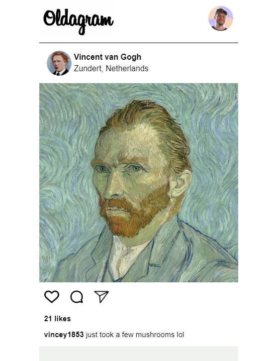

# Oldagram

Dieses Projekt ist eine einfache Webanwendung, die Posts rendert. Die Posts werden aus einem Array von Post-Objekten erstellt und auf der Webseite angezeigt.

## Funktionen
- **Erstellen und Rendern von Posts**: Die Anwendung nimmt eine Liste von Post-Objekten und rendert sie auf der Webseite. Jeder Post kann ein Bild, einen Benutzernamen, einen Standort, ein Profilbild, einen Kommentar und eine Anzahl von Likes enthalten.
- **Interaktion mit Posts**: Benutzer können auf das Bild oder den Like-Button eines Posts klicken, um die Anzahl der Likes zu erhöhen.

## Vorschau

## Technologien
- HTML
- CSS

